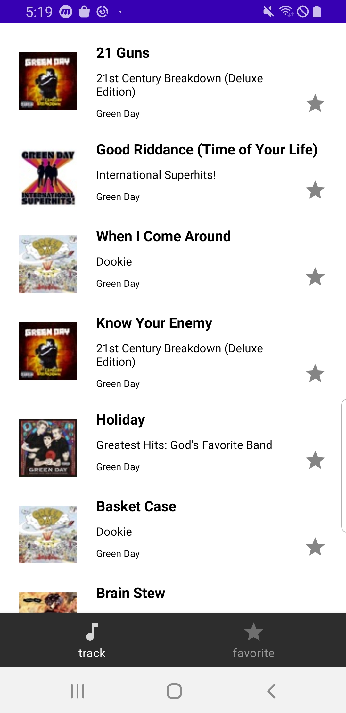
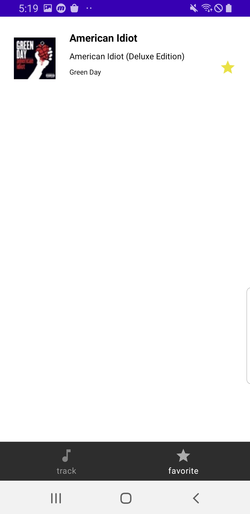
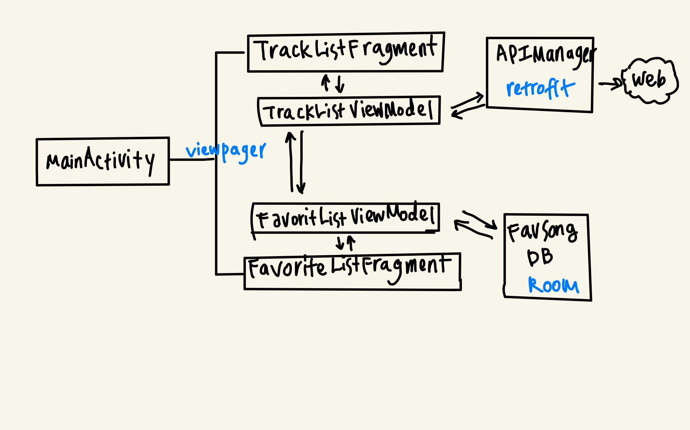

# ITunesMusic
iTunes search API를 이용한 트랙리스트 App

### 기능

- "Greenday" 키워드로 검색된 결과를 보여준다.
- "Favorite"에 추가된 아이템들을 보여준다. 

### 기능 구현 

1. #### "Greenday" 키워드로 검색된 결과를 보여준다.

   - https://affiliate.itunes.apple.com/resources/documentation/itunes-store-web-service-search-api/ 에서 Greenday 키워드를 검색하여 RecyclerView에 보여준다. 
   - 각 트랙 아이템은  trackName, collectionName(앨범 이름), artistName, artwork 를 보여주어야 하고 Favorite 토글 버튼(별)이 있어야 한다. 
   - 별표를 클릭하면 Favortie으로 등록되고, 이미 등록된 Favorite Track은 삭제된다.

    

2. #### "Favorite"에 추가된 아이템들을 보여준다. 

   - "Favorite"에 추가된 아이템들은 앱을 재실행해도 유지되어야한다. -> 기기의 저장소에 데이터 값을 저장해야한다. 

### 프로젝트 구성 

1. MainActivity: BottomNavigation, Viewpager로 두개의 Fragment를 가지고 있다. Navigation이 클릭될 때 마다 Fragment를 이동시킨다.
2. TrackListFragment: Greenday로 검색되는 트랙리스트들을 보여준다. 처음엔 50개의 아이템을 보여주고, 이후 화면이 마지막으로 스크롤 될 때 마다 50개씩 더 로딩한다.
3. TrackListViewModel: APIManager를 통해 네트워킹을 실행하고, 받아온 데이터를 TrackListFragment에 보여준다. 
4. FavoriteListFragment: Favorite에 추가한 트랙리스트들을 보여준다. 
5. FavoriteListViewModel: FavSongDB를 통해 Room에 데이터를 저장하고, 삭제하고 불러온다. TrackList 화면에서도 Favorite을 등록하고 삭제할 수 있으므로 TrackListFragment에서도 FavoriteListViewModel을 참조한다. 